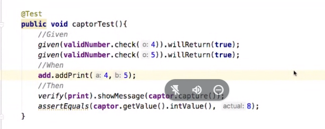

# JUnit

- JUNIT Platform
- JUnit Jupiter
    Seria JUnit 5 , usa lambdas
    Nuevos modelos de asserts, 
- JUNIT Vintage
    Nos permite realizar lo que teniamos ya en JUnit 3 y 4

## General config
- Archivo terminado en "Test"
- @Test arriba del metodo a testear
- Importar dependendcias de
    - mockito
    - JUnit
    - mockito-junit-jupiter (si es JUnit 5)

```java

@Before
public void setUp(){
    // codigo que se ejecuta antes del batch de Tests
}

@Test
public void when_userClicksButton_then_popUpAppears(){
    when(somethingHappens).thenReturn(something);
}

```

## Parameterised testing
https://youtu.be/0ZtU3X9n6tI?t=769


## Asserts
```java

assertSame // chequea que el OBJETO sea el mismo
assertFalse
assertTrue
assertEquals(expect, actual, delta) // el delta es un ma menos para que no falle
assertNull
assertNotNull
assertThrows(arithmeticException.class, ()->calculator.divideByZero(2,0)) // paso un metodo que tire error

// Arrange 
// Act
// Assert

//Given
//When
//Then

```

# Mockito
## @Captor
Sirve para capturar la evaluacion de un metodo

```java


```

# Mock

1. Mock dependencias de la clase bajo test
2. Ejecutar codigo de la clase bajo test
3. Validar el codigo que sea el esperado

# Stub
    Es un fake al que se le programan sus valores de retorno

# Spy
    Mezclo objetos mockeados y otros metodos puros

# Errores comunes
## Pide algo de MockMaker
https://youtu.be/2S6Mq-ylg3k?t=3915

